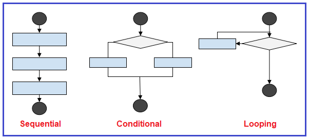

# Zero-to-Hero-in-Python
Contains the basic to advanced concepts of python

##  [Setup And Installation](https://github.com/vishalkmr/Zero-to-Hero-in-Python/blob/main/Setup%20And%20Installation.ipynb) 
- Basic Python Setup
    - Windows
    - Ubuntu
- Anaconda Distribution Setup
    - Windows
    - Ubuntu
- Google Colab

## [Getting Started With Python](https://github.com/vishalkmr/Zero-to-Hero-in-Python/blob/main/Getting%20Started%20With%20Python.ipynb) 
- Output
- Comments
- Variables
- Input
- Indentaion

## [Operators](https://github.com/vishalkmr/Zero-to-Hero-in-Python/blob/main/Operators.ipynb) 
- Arithmetic Operators
    - Addition
    - Subtraction
    - Multiplication
    - Division
    - Floor Division
    - Exponentiation
- Comparison Operators
    - Greater than
    - Less than
    - Equal to
    - Not equal to
    - Greater than or equal to
    - Less than or equal to
- Logical Operators
    - Or
    - And
    - Not
- Bitwise Operators
    - Bitwise OR
    - Bitwise AND
    - Bitwise Not
    - Bitwise XOR
    - Bitwise Right shift
    - Bitwise Left shift
- Assignment Operators
- Membership Operators
    - In
    - Not in
- Identity Operators
    - Is
    - Is not

## [ Control Flow](https://github.com/vishalkmr/Zero-to-Hero-in-Python/blob/main/%20Control%20Flow.ipynb) 
- Conditional Statements
    - if
    - if .. else
    - if .. elif .. else
    - Nested if
    - switch
- Iterative Statements
    - for loop
    - while loop
- Functions
    - Arguments Passing
    - Default Arguments
    - Positional & Keyword Arguments
    - Variable-Length Arguments
    - Docstrings
    - Lambda Functions
    - Global, Local and Nonlocal Variables

## [Data Type](https://nbviewer.org/github/vishalkmr/Zero-to-Hero-in-Python/blob/main/Data%20Type.ipynb?flush_cache=true) 
- [Numbers](https://nbviewer.org/github/vishalkmr/Zero-to-Hero-in-Python/blob/main/Data%20Type.ipynb?flush_cache=true#Numbers)
    - [int](https://nbviewer.org/github/vishalkmr/Zero-to-Hero-in-Python/blob/main/Data%20Type.ipynb?flush_cache=true#int)
    - [float](https://nbviewer.org/github/vishalkmr/Zero-to-Hero-in-Python/blob/main/Data%20Type.ipynb?flush_cache=true#float)
    - [complex](https://nbviewer.org/github/vishalkmr/Zero-to-Hero-in-Python/blob/main/Data%20Type.ipynb?flush_cache=true#complex)
- [Boolean](https://nbviewer.org/github/vishalkmr/Zero-to-Hero-in-Python/blob/main/Data%20Type.ipynb?flush_cache=true#Boolean)
- [List](https://nbviewer.org/github/vishalkmr/Zero-to-Hero-in-Python/blob/main/Data%20Type.ipynb?flush_cache=true#List)
    - [Creating a List](https://nbviewer.org/github/vishalkmr/Zero-to-Hero-in-Python/blob/main/Data%20Type.ipynb?flush_cache=true#Creating_List)
    - [Accessing List Elements](https://nbviewer.org/github/vishalkmr/Zero-to-Hero-in-Python/blob/main/Data%20Type.ipynb?flush_cache=true#Accessing_List)
    - [Accessing the Index of an Element in the List](https://nbviewer.org/github/vishalkmr/Zero-to-Hero-in-Python/blob/main/Data%20Type.ipynb?flush_cache=true#Accessing_List_Index)
    - [Updating a List](https://nbviewer.org/github/vishalkmr/Zero-to-Hero-in-Python/blob/main/Data%20Type.ipynb?flush_cache=true#Updating_List)       
    - [Inserting Elements to the List](https://nbviewer.org/github/vishalkmr/Zero-to-Hero-in-Python/blob/main/Data%20Type.ipynb?flush_cache=true#Inserting_List)    
    - [Deleting Elements from the List](https://nbviewer.org/github/vishalkmr/Zero-to-Hero-in-Python/blob/main/Data%20Type.ipynb?flush_cache=true#Deleting_List)    
    - [Miscellaneous Functions](https://nbviewer.org/github/vishalkmr/Zero-to-Hero-in-Python/blob/main/Data%20Type.ipynb?flush_cache=true#Miscellaneous_Functions_List)    
    - [Copying  Lists](https://nbviewer.org/github/vishalkmr/Zero-to-Hero-in-Python/blob/main/Data%20Type.ipynb?flush_cache=true#Copying_List)        
    - [Arithmetic Operation on Lists](https://nbviewer.org/github/vishalkmr/Zero-to-Hero-in-Python/blob/main/Data%20Type.ipynb?flush_cache=true#Arithmetic_List)
    - [List Membership](https://nbviewer.org/github/vishalkmr/Zero-to-Hero-in-Python/blob/main/Data%20Type.ipynb?flush_cache=true#List_Membership)
    - [List Comprehension](https://nbviewer.org/github/vishalkmr/Zero-to-Hero-in-Python/blob/main/Data%20Type.ipynb?flush_cache=true#Comprehension_List)    
- [Tuple](https://nbviewer.org/github/vishalkmr/Zero-to-Hero-in-Python/blob/main/Data%20Type.ipynb?flush_cache=true#Tuple)
    - [Creating a Tuple](https://nbviewer.org/github/vishalkmr/Zero-to-Hero-in-Python/blob/main/Data%20Type.ipynb?flush_cache=true#Creating_Tuple)
    - [Accessing Tuple Elements](https://nbviewer.org/github/vishalkmr/Zero-to-Hero-in-Python/blob/main/Data%20Type.ipynb?flush_cache=true#Accessing_Tuple)    
    - [Updating Tuple](https://nbviewer.org/github/vishalkmr/Zero-to-Hero-in-Python/blob/main/Data%20Type.ipynb?flush_cache=true#Updating_Tuple)       
    - [Miscellaneous Functions](https://nbviewer.org/github/vishalkmr/Zero-to-Hero-in-Python/blob/main/Data%20Type.ipynb?flush_cache=true#Miscellaneous_Functions_Tuple)    
    - [Copying  Tuples](https://nbviewer.org/github/vishalkmr/Zero-to-Hero-in-Python/blob/main/Data%20Type.ipynb?flush_cache=true#Copying_Tuple)        
    - [Arithmetic Operation on Tuples](https://nbviewer.org/github/vishalkmr/Zero-to-Hero-in-Python/blob/main/Data%20Type.ipynb?flush_cache=true#Arithmetic_Tuple)
    - [Tuple Membership](https://nbviewer.org/github/vishalkmr/Zero-to-Hero-in-Python/blob/main/Data%20Type.ipynb?flush_cache=true#Tuple_Membership)
- [Set](https://nbviewer.org/github/vishalkmr/Zero-to-Hero-in-Python/blob/main/Data%20Type.ipynb?flush_cache=true#Set)
    - [Creating a Set](https://nbviewer.org/github/vishalkmr/Zero-to-Hero-in-Python/blob/main/Data%20Type.ipynb?flush_cache=true#Creating_Set)
    - [Accessing Set Elements](https://nbviewer.org/github/vishalkmr/Zero-to-Hero-in-Python/blob/main/Data%20Type.ipynb?flush_cache=true#Accessing_Set)     
    - [Inserting Elements to the Set](https://nbviewer.org/github/vishalkmr/Zero-to-Hero-in-Python/blob/main/Data%20Type.ipynb?flush_cache=true#Inserting_Set)    
    - [Deleting Elements from the Set](https://nbviewer.org/github/vishalkmr/Zero-to-Hero-in-Python/blob/main/Data%20Type.ipynb?flush_cache=true#Deleting_Set)    
    - [Set Operations](https://nbviewer.org/github/vishalkmr/Zero-to-Hero-in-Python/blob/main/Data%20Type.ipynb?flush_cache=true#Set_Operations)    
    - [Copying  Sets](https://nbviewer.org/github/vishalkmr/Zero-to-Hero-in-Python/blob/main/Data%20Type.ipynb?flush_cache=true#Copying_Set)
    - [Arithmetic Operation on Sets](https://nbviewer.org/github/vishalkmr/Zero-to-Hero-in-Python/blob/main/Data%20Type.ipynb?flush_cache=true#Arithmetic_Set)
    - [Set Membership](https://nbviewer.org/github/vishalkmr/Zero-to-Hero-in-Python/blob/main/Data%20Type.ipynb?flush_cache=true#Set_Membership)
- [Dictionary](https://nbviewer.org/github/vishalkmr/Zero-to-Hero-in-Python/blob/main/Data%20Type.ipynb?flush_cache=true#Dictionary)
    - [Creating a Dictionary](https://nbviewer.org/github/vishalkmr/Zero-to-Hero-in-Python/blob/main/Data%20Type.ipynb?flush_cache=true#Creating_Dictionary)
    - [Accessing Dictionary Elements](https://nbviewer.org/github/vishalkmr/Zero-to-Hero-in-Python/blob/main/Data%20Type.ipynb?flush_cache=true#Accessing_Dictionary)
    - [Updating & Inserting Elements to the Dictionary](https://nbviewer.org/github/vishalkmr/Zero-to-Hero-in-Python/blob/main/Data%20Type.ipynb?flush_cache=true#Updating_Dictionary)          
    - [Deleting Elements from the Dictionary](https://nbviewer.org/github/vishalkmr/Zero-to-Hero-in-Python/blob/main/Data%20Type.ipynb?flush_cache=true#Deleting_Dictionary)     
    - [Copying Dictionary ](https://nbviewer.org/github/vishalkmr/Zero-to-Hero-in-Python/blob/main/Data%20Type.ipynb?flush_cache=true#Copying_Dictionary)        
    - [Dictionary Membership](https://nbviewer.org/github/vishalkmr/Zero-to-Hero-in-Python/blob/main/Data%20Type.ipynb?flush_cache=true#Dictionary_Membership)
    - [Dictionary Comprehension](https://nbviewer.org/github/vishalkmr/Zero-to-Hero-in-Python/blob/main/Data%20Type.ipynb?flush_cache=true#Comprehension_Dictionary)   
- [Strings](https://nbviewer.org/github/vishalkmr/Zero-to-Hero-in-Python/blob/main/Data%20Type.ipynb?flush_cache=true#Strings)
    - [Creating a String](https://nbviewer.org/github/vishalkmr/Zero-to-Hero-in-Python/blob/main/Data%20Type.ipynb?flush_cache=true#Creating_String)
    - [Accessing Characters in a String ](https://nbviewer.org/github/vishalkmr/Zero-to-Hero-in-Python/blob/main/Data%20Type.ipynb?flush_cache=true#Accessing_String)
    - [Updating a String](https://nbviewer.org/github/vishalkmr/Zero-to-Hero-in-Python/blob/main/Data%20Type.ipynb?flush_cache=true#Updating_String)          
    - [String Operators](https://nbviewer.org/github/vishalkmr/Zero-to-Hero-in-Python/blob/main/Data%20Type.ipynb?flush_cache=true#String_Operators)    
    - [Formatting Strings](https://nbviewer.org/github/vishalkmr/Zero-to-Hero-in-Python/blob/main/Data%20Type.ipynb?flush_cache=true#Formatting_Strings) 
    - [String Functions](https://nbviewer.org/github/vishalkmr/Zero-to-Hero-in-Python/blob/main/Data%20Type.ipynb?flush_cache=true#String_Functions) 
    - [Converting List items into a String](https://nbviewer.org/github/vishalkmr/Zero-to-Hero-in-Python/blob/main/Data%20Type.ipynb?flush_cache=true#Converting_String)        
    - [String Membership](https://nbviewer.org/github/vishalkmr/Zero-to-Hero-in-Python/blob/main/Data%20Type.ipynb?flush_cache=true#String_Membership)