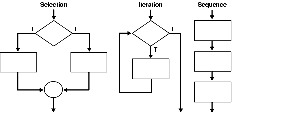

# Zero-to-Hero-in-Python
Contains the basic to advanced concepts of python

##  [Setup And Installation](https://github.com/vishalkmr/Zero-to-Hero-in-Python/blob/main/Setup%20And%20Installation.ipynb)   
- Basic Python Setup
    - Windows
    - Ubuntu
- Anaconda Distribution Setup
    - Windows
    - Ubuntu
- Google Colab

## [Getting Started With Python](https://github.com/vishalkmr/Zero-to-Hero-in-Python/blob/main/Getting%20Started%20With%20Python.ipynb)
- Output
- Comments
- Variables 
- Input
- Indentaion

## [Operators](https://github.com/vishalkmr/Zero-to-Hero-in-Python/blob/main/Operators.ipynb)

- Arithmetic Operators
    - Addition
    - Subtraction
    - Multiplication
    - Division
    - Floor Division
    - Exponentiation
- Comparison Operators
    - Greater than
    - Less than
    - Equal to
    - Not equal to
    - Greater than or equal to
    - Less than or equal to
- Logical Operators
    - Or
    - And
    - Not
- Bitwise Operators
    - Bitwise OR
    - Bitwise AND
    - Bitwise Not
    - Bitwise XOR
    - Bitwise Right shift
    - Bitwise Left shift
- Assignment Operators
- Membership Operators
    - In
    - Not in
- Identity Operators
    - Is
    - Is not

## [ Control Flow](https://github.com/vishalkmr/Zero-to-Hero-in-Python/blob/main/%20Control%20Flow.ipynb)

- Conditional Statements
    - if
    - if .. else
    - if .. elif .. else
    - Nested if
    - switch
- Iterative Statements
    - for loop
    - while loop
- Functions
    - Arguments Passing
    - Default Arguments
    - Positional & Keyword Arguments
    - Variable-Length Arguments
    - Docstrings
    - Lambda Functions
    - Global, Local and Nonlocal Variables
## [Data Type](https://github.com/vishalkmr/Zero-to-Hero-in-Python/blob/main/Data%20Type.ipynb)

- Numbers
    - int
    - float
    - complex
- Boolean
- List
    - Creating a List
    - Accessing List Elements
    - Accessing the Index of an Element in the List
    - Updating a List
    - Inserting Elements to the List
    - Deleting Elements from the List
    - Miscellaneous Functions
    - Copying  Lists
    - Arithmetic Operation on Lists
    - List Membership
    - List Comprehension
- Tuple
    - Creating a Tuple
    - Accessing Tuple Elements
    - Updating Tuple
    - Miscellaneous Functions
    - Copying  Tuples
    - Arithmetic Operation on Tuples
    - Tuple Membership
- Set
    - Creating a Set
    - Accessing Set Elements
    - Inserting Elements to the Set
    - Deleting Elements from the Set
    - Set Operations
    - Copying  Sets
    - Arithmetic Operation on Sets
    - Set Membership
- Dictionary
    - Creating a Dictionary
    - Accessing Dictionary Elements
    - Updating & Inserting Elements to the Dictionary
    - Deleting Elements from the Dictionary
    - Copying Dictionary 
    - Dictionary Membership
    - Dictionary Comprehension
- Strings
    - Creating a String
    - Accessing Characters in a String 
    - Updating a String
    - String Operators
    - Formatting Strings
    - String Functions
    - Converting List items into a String
    - String Membership
 
img[src*='#left'] {
    float: left;
}
img[src*='#right'] {
    float: right;
}
img[src*='#center'] {
    display: block;
    margin: auto;
}